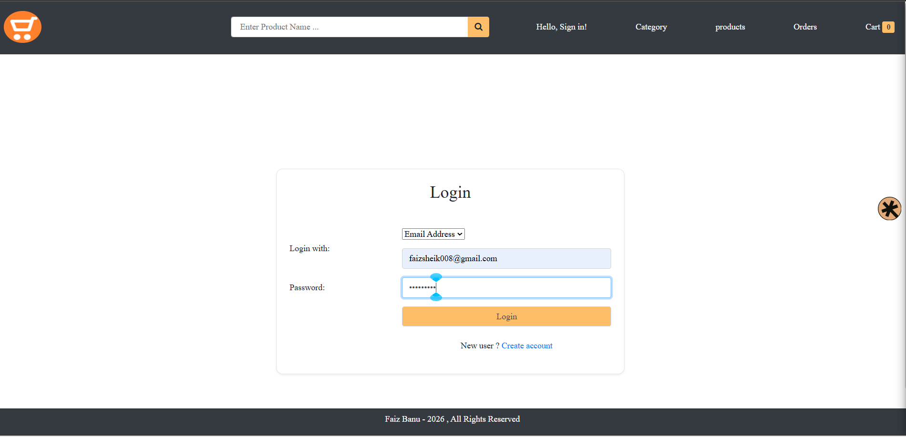
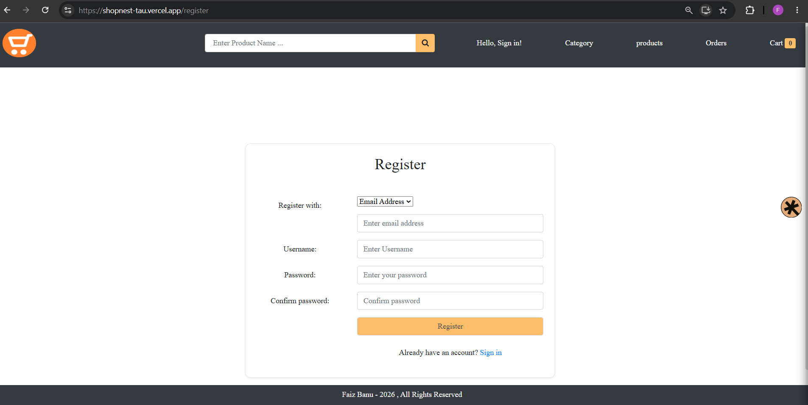
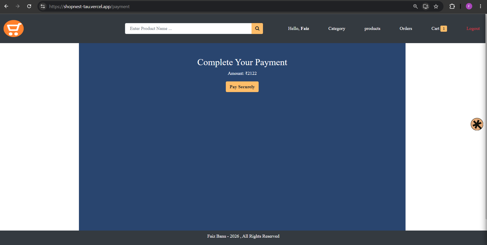
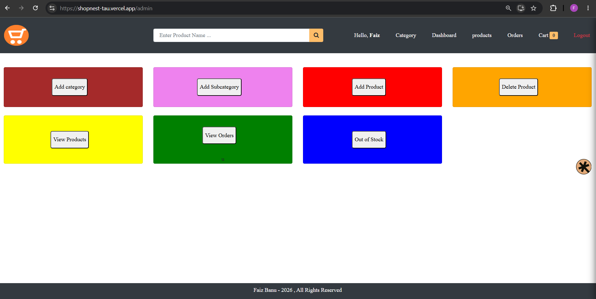

# 🛍️ ShopNest
### A Full-Stack MERN E-Commerce Web Application

ShopNest is an e-commerce platform built using the MERN stack (MongoDB, Express.js, React.js, and Node.js). It enables users to view products, manage their shopping cart, place orders, and securely authenticate using JWT. An admin dashboard allows administrators to manage products, and view customer orders.

---

## 🌐 Live Demo 
https://shopnest-tau.vercel.app/

---

# ✨ Features

## 👤 User Features

- View categories, sub-categories, and products
- View Product Details
- Add Items to Cart
- Update Cart Quantity
- Remove Items from Cart
- Place Orders
- View Order History
- Product Review & Rating
- Payment and order confirmation email

### 🛡 Authentication

- JWT-based Authentication
- Protected Routes
- Secure Password Hashing

### 👨‍💼 Admin Features

- Admin Login
- Dashboard
- Add categories, sub-categories, products
- Delete Products
- Upload Product Images
- View Customer Orders
- Mark Products as Out of Stock

---
# 🛠 Tech Stack

## Frontend

- JavaScript (ES6+)
- HTML
- CSS
- Bootstrap
- React Router DOM
- React Hooks (`useState`, `useEffect`)
- Fetch API (Async/Await)
- React Toastify

## Backend

- Node.js
- Express.js
- JWT Authentication
- bcrypt
- dotenv
- CORS

## Database

- MongoDB Atlas
- Mongoose

## Cloud & Services

- Cloudinary (Image Storage)
- Render (Backend Deployment)
- Vercel (Frontend Deployment)

## Integrations

- Razorpay Payment Gateway
- Resend Email Service

## Development Tools

- Visual Studio Code
- Git
- GitHub
- Thunderclient

---

## 📸 Screenshots

| Login | Registration |
|-------|------|
|  |  |


| View categories | View Products |
|-------|------|
|  |  |


| Product Details | Cart |
|-----------------|------|
|  |  |

| Payment | Order Summary |
|----------|---------------|
|  |  |

 Email | Product Review |
|----------|---------------|
|  |  |

| Admin Dashboard | View Orders |
|-----------------|-------------|
|  |  | 

Add Products |
|----------|
|  |

---

# 📁 Project Structure

```
SHOPNEST
│
├── backend
│   ├── config
│   ├── controllers
│   ├── data
│   ├── middleware
│   ├── models
│   ├── routes
│   ├── utils
│   ├── app.js
│   ├── package.json
│   └── testEmail.js
│
├── frontend
│   ├── build
│   ├── public
│   ├── src
│   │   ├── admin
│   │   ├── Authentication
│   │   ├── components
│   │   ├── pages
│   │   │   ├── Cart.js
│   │   │   ├── Home.js
│   │   │   ├── OrderHistory.js
│   │   │   ├── OrderSummary.js
│   │   │   ├── OrderSuccess.js
│   │   │   ├── Payment.js
│   │   │   ├── ProductDetails.js
│   │   │   ├── ProductReview.js
│   │   │   ├── ShippingDetails.js
│   │   │   ├── ViewCategory.js
│   │   │   ├── ViewSubCategory.js
│   │   │   └── ViewOrder.js
│   │   │
│   │   ├── App.js
│   │   ├── App.css
│   │   ├── index.js
│   │   └── index.css
│   │
│   ├── .env
│   ├── package.json
│   └── README.md
│
├── templates
├── .gitignore
└── README.md
```
---

# 🚀 Getting Started

Follow the steps below to run ShopNest locally.

---

# 📋 Prerequisites

Install the following before running the project:

- Node.js (v18 or later)  -- v18.15.0 used in my project
- npm
- MongoDB Atlas Account
- Cloudinary Account
- Git
- VS Code (Recommended)

---

# 📥 Clone Repository

```bash
git clone https://github.com/yourusername/shopnest.git

cd shopnest
```

---

# ⚙ Backend Setup

```bash
cd backend

npm install
```

Create a `.env` file inside the backend folder.

```env
# Server Configuration
PORT=8000
NODE_ENV=development

# Database
DB_URL=mongodb://localhost:27017/mini-ecommerce

# Authentication
JWT_SECRET=your_jwt_secret

# Email Service
SMTP_EMAIL=your_email@gmail.com
RESEND_API_KEY=your_resend_api_key

# Razorpay Payment Gateway
RAZORPAY_KEY_ID=your_razorpay_key_id
RAZORPAY_KEY_SECRET=your_razorpay_key_secret

Start the backend server.

```bash
npm start
```

or (if using nodemon)

```bash
npm run dev
```

---

# 💻 Frontend Setup

```bash
cd frontend

npm install
```

Create a `.env` file inside the frontend folder.

```env
REACT_APP_API_URL=http://localhost:8000/api/v1
```

Run the frontend.

```bash
npm run dev
```

The application will be available at

```
http://localhost:3000
```

---

## 📧 Email Service

The project uses **Resend** to send transactional emails.

> **Note:** With the default Resend testing configuration, emails can only be sent to verified email addresses associated with the Resend account. To send emails to any recipient, verify your own domain and configure it in your Resend account.

---

## 🚀 Future Enhancements

- OTP verification during login
- Send password reset email
- Product searching and filtering


